# Terraledger — Environmental Scheme Application Intelligence Platform

An end-to-end POC for the Directorate of Environment and Climate Change:
ingests scheme applications, extracts and validates their documents, scores
them with a deterministic rule engine **and** an explainable ML model
(SHAP), routes them to a reviewer, and records every decision to an
append-only audit trail. **AI recommends; a human always makes the final
determination** — see `docs/architecture.md` for how that's enforced.

```
backend/    FastAPI + SQLAlchemy + scikit-learn/SHAP
frontend/   React + Vite + Tailwind
docs/       Architecture, data flow, trust boundaries, evaluation rubric
.vscode/    Ready-to-use debug configs and tasks
```
## Architecture

Modular monolith (see [ADR-001](#adr-001-modular-monolith-over-microservices)
below) with four cooperating layers.


### End-to-end data flow

```mermaid
flowchart LR
    S["Applicant submits application + documents"] --> T["[Application created] status = SUBMITTED"]
    T --> U["[Documents uploaded] stored locally, hashed, tagged RESTRICTED | SYNTHETIC"]
    U --> V["POST /applications/{id}/process"]
    V --> W["PROCESSING: extraction_service (OCR / text / xlsx / lang)"]
    W --> X["VALIDATED: validation_service (completeness / eligibility / contradictions)"]
    X --> Y["fraud_service (duplicate / document-reuse / date anomalies)"]
    Y --> Z["AI_ANALYZED: scoring_service (rule-based total)"]
    Z --> Z2["ml_scoring_service (GBM prediction + SHAP explanation)"]
    Z2 --> R["REVIEW_PENDING: assigned to reviewer"]
    R --> H["UNDER_REVIEW: reviewer approves/rejects/requests info"]
    H --> C["APPROVED/REJECTED/NEEDS_INFO -> CLOSED (audit trail)"]
    style V fill:#bfb,stroke:#333
    style Z fill:#ffb,stroke:#333
    style Z2 fill:#ffc,stroke:#333
    style H fill:#fc9,stroke:#333
    style C fill:#fc9,stroke:#333
```



### Trust boundaries (summary)

| Boundary | What crosses it | Control |
|---|---|---|
| Browser ↔ Backend | JSON over HTTPS, uploaded files | CORS allow-list (`CORS_ORIGINS`) + Pydantic validation |
| Backend ↔ PostgreSQL | All structured records | Isolated Docker bridge network (`eco-review-net`) |
| Backend ↔ Local storage | Raw uploaded documents | Per-app scoped path; never served directly |
| Backend ↔ External AI | Structured summaries/fields only | `AI_PROVIDER=mock` (default); `openai` opt-in dev only — raw `RESTRICTED` text never crosses |
| Backend ↔ ML model | Numeric feature vectors only | Fully local scikit-learn/SHAP inference; no PII in features |

---

## Quickstart (Docker — recommended)

Requires Docker Desktop (or Docker Engine + Compose) with network access
for the image builds.

```bash
git clone <your-fork-url> terraledger
cd terraledger

cp backend/.env.example backend/.env
# optional: edit backend/.env if you want AI_PROVIDER=openai

docker compose up --build
```

- Frontend: **http://localhost:5173**
- Backend API + interactive docs: **http://localhost:8000/docs**
- Postgres: `localhost:5432` (`eco_admin` / `eco_pass`, db `eco_review`)

The database is empty on first boot. Seed the required synthetic dataset
(complete / incomplete / contradictory / duplicate / suspicious /
low-quality / borderline applications) and train the ML model in one step:

```bash
docker compose exec backend python -m app.data.synthetic_generator
```

Refresh the frontend — the dashboard, reviewer queue, and analytics pages
will now be populated, and every scored application will include the
SHAP-explained ML second opinion.

To stop: `docker compose down` (add `-v` to also drop the Postgres volume).

---

## Running from VS Code (local dev, hot reload)

Open the repo root as the VS Code workspace — `.vscode/` already has debug
configs and tasks wired up.

**1. Backend**

```bash
cd backend
python -m venv .venv
source .venv/bin/activate        # Windows: .venv\Scripts\activate
pip install -r requirements.txt
cp .env.example .env
```

By default `.env` points at Postgres via Docker Compose. For a local run
without Docker, either start just the database (`docker compose up db`)
or switch `DATABASE_URL` in `.env` to SQLite:
```
DATABASE_URL=sqlite:///./eco_review_dev.db
```

Then either run the **"Backend: FastAPI (uvicorn)"** launch config (F5),
or from the terminal:
```bash
uvicorn app.main:app --reload --port 8000
```

**2. Frontend**

```bash
cd frontend
npm install
cp .env.example .env   # VITE_API_BASE_URL=http://localhost:8000
npm run dev
```
Or use the **"Frontend: dev server"** task (`Ctrl/Cmd+Shift+P` → *Run
Task*). Visit **http://localhost:5173**.

**3. Seed data + train the ML model**
```bash
cd backend
python -m app.data.synthetic_generator
```
(Also available as the **"Backend: seed synthetic data"** launch config.)

**4. Tests**
```bash
cd backend
pytest -v
```
Note: `test_ml_scoring.py` needs `scikit-learn` and `shap` installed
(they're in `requirements.txt`) — skip with `pytest -m "not slow"` isn't
configured, so just make sure `pip install -r requirements.txt` completed
fully before running the full suite.

---

## Connecting to GitHub

```bash
cd terraledger
git init
git add .
git commit -m "Initial commit: Terraledger application intelligence platform"

# Create an empty repo on GitHub first (no README/license, to avoid conflicts), then:
git remote add origin https://github.com/<your-username>/<your-repo>.git
git branch -M main
git push -u origin main
```

Suggested branching for further work: `main` (stable) + short-lived
feature branches (`feature/multilingual-improvements`, `fix/ocr-fallback`,
...) merged via PR — the repo already excludes secrets, the SQLite dev DB,
uploaded documents, and trained model artifacts via `.gitignore`, so a
fresh clone never leaks RESTRICTED-adjacent local state.

---

## Deploying with Docker (production-shaped)

`docker-compose.yml` builds three services (`db`, `backend`, `frontend`)
on an isolated bridge network, with the backend exposing `8000` and the
frontend serving the built SPA via nginx on `5173`.

For an actual on-prem/production deployment:
1. Set real secrets in `backend/.env` (`SECRET_KEY`, DB credentials) —
   never commit this file.
2. Set `CORS_ORIGINS` to your real frontend origin.
3. Put the stack behind a reverse proxy / TLS terminator (out of scope
   for this POC's compose file, but `frontend`'s nginx and `backend`'s
   uvicorn are both proxy-friendly as-is).
4. Keep `AI_PROVIDER=mock` unless you've reviewed exactly which fields
   `assistant_service.py` sends to a cloud provider (see
   `docs/architecture.md` §4) — for a real government deployment  this
   should stay fully on-prem.
5. Mount `eco_review_documents` and `eco_review_pgdata` on durable,
   backed-up storage — they're named Docker volumes by default, fine for
   a demo, not sufficient for production retention requirements on their
   own.

Rebuild after code changes:
```bash
docker compose up --build
```

Retrain the ML model after seeding more data or changing features:
```bash
docker compose exec backend python -m app.ml.train
# or: curl -X POST http://localhost:8000/api/v1/ml/train
```

---

## Key API endpoints

| Method | Path | Purpose |
|---|---|---|
| `POST` | `/api/v1/applications` | Submit a new application |
| `POST` | `/api/v1/applications/{id}/documents` | Upload a document (multipart) |
| `POST` | `/api/v1/applications/{id}/process` | Run extraction → validation → fraud → scoring → routing |
| `GET` | `/api/v1/applications/{id}` | Full detail (documents, scores, fraud signals, decisions) |
| `POST` | `/api/v1/applications/{id}/assign` | Assign a reviewer |
| `POST` | `/api/v1/applications/{id}/decisions` | Record a human review decision (override reason required if it diverges from the AI recommendation) |
| `GET` | `/api/v1/applications/{id}/audit` | Full audit trail |
| `POST` | `/api/v1/applications/{id}/feedback` | Submit reviewer feedback on AI scoring quality |
| `GET` | `/api/v1/feedback/summary` | Aggregate AI feedback statistics |
| `GET` | `/api/v1/assistant/applications/{id}/summary` | Generate AI-assisted application summary |
| `POST` | `/api/v1/assistant/ask` | Reviewer assistant Q&A |
| `GET` | `/api/v1/analytics/summary` | Dashboard/analytics metrics |
| `GET` | `/api/v1/reports/applications.csv` | Export applications register as CSV |
| `GET` | `/api/v1/reports/applications/{id}/pdf` | Export single application as PDF reviewer report |
| `POST` | `/api/v1/ml/train` | (Re)train the SHAP-explainable ML scoring model |
| `GET` | `/api/v1/ml/status` | Current model metadata |
| `GET` | `/api/v1/integrations/status` | Adapter health (portal, messaging, translation) |
| `GET` | `/api/v1/integrations/languages` | Supported languages for detection and translation |
| `GET` | `/api/v1/integrations/notifications` | Mock notification log (demo) |
| `POST` | `/api/v1/integrations/portal/sync/{id}` | Manually sync application status to portal |
| `POST` | `/api/v1/integrations/portal/ingest` | Ingest an application from the schemes portal |

Full interactive docs (OpenAPI/Swagger) at `/docs` once the backend is running.

---

## Advanced features

### AI-assisted summarisation

Each application detail page has a **Generate summary** button (visible after the pipeline has run). Click it to get a structured AI briefing covering documents, validation, fraud signals, score, and recommendation. The summary is built from structured fields only — no raw document text is sent to any AI provider.

### Reporting & export

**CSV export** — go to the **Analytics** page and use the "Export Register" panel. Optionally filter by status before downloading. The CSV includes scores, risk levels, AI recommendations, fraud signal counts, and human decisions, with a UTF-8 BOM for direct Excel compatibility.

**PDF report** — on any application detail page, click **Export PDF** (top-right of the overview panel). The report opens inline in the browser and covers all 8 sections: overview, documents, extracted fields, validation, fraud signals, AI scoring with SHAP explanation, human review decision, and audit trail.

### Structured logging

All backend logs are emitted as JSON to stdout. View them with:

```bash
# Docker
docker compose logs -f backend

# Local
uvicorn app.main:app --reload --port 8000
```

Every HTTP request logs `method`, `path`, `status_code`, `duration_ms`, and a `request_id` UUID. The same `request_id` is returned in the `X-Request-ID` response header for frontend error correlation.

Control verbosity via `LOG_LEVEL` in `backend/.env` (default: `INFO`). Valid values: `DEBUG`, `INFO`, `WARNING`, `ERROR`.

### Multilingual support

The platform detects the language of every uploaded document automatically (using `langdetect`, fully local). Supported languages: English, Hindi, Bengali, Tamil, Telugu, Marathi, Gujarati, Kannada, Malayalam, Punjabi, Urdu, Odia.

**Mock mode (default):** language is detected and labelled; no translation is applied. Non-English amounts in Devanagari/Indic scripts are extracted using script-aware patterns.

**Live translation (optional):** point to any [LibreTranslate](https://libretranslate.com)-compatible endpoint (self-hostable for on-prem):

```bash
# 1. Run LibreTranslate locally
docker run -p 5000:5000 libretranslate/libretranslate

# 2. Enable in backend/.env
TRANSLATION_ADAPTER=live
TRANSLATION_BASE_URL=http://localhost:5000
TRANSLATION_API_KEY=          # leave blank for local LibreTranslate
```

Rebuild the backend after changing `.env`:
```bash
docker compose up --build backend
```

Check which languages are available and whether translation is active:
```bash
curl http://localhost:8000/api/v1/integrations/languages
```

### Portal & messaging adapters

Both adapters run in **mock mode** by default — they log calls and store notifications in memory but make zero network calls. This is the correct mode for RESTRICTED data.

**View mock notifications** sent during the current session:
```bash
curl http://localhost:8000/api/v1/integrations/notifications
```

**Enable live portal integration:**
```bash
# backend/.env
PORTAL_ADAPTER=live
PORTAL_BASE_URL=https://your-portal-api.gov.in
PORTAL_API_KEY=your-api-key
```

**Enable live messaging (SMTP):**
```bash
# backend/.env
MESSAGING_ADAPTER=live
SMTP_HOST=smtp.gov.in
SMTP_PORT=587
SMTP_USER=noreply@gov.in
SMTP_PASSWORD=your-password
```

**Simulate a portal-originated application:**
```bash
curl -X POST http://localhost:8000/api/v1/integrations/portal/ingest \
  -H "Content-Type: application/json" \
  -d '{"applicant_name": "Test Applicant", "scheme_name": "Environmental Scheme", "requested_amount": 500000}'
```

### Evaluation

Run the evaluation script to measure extraction accuracy, validation accuracy, fraud detection precision/recall, and ML scoring quality against the synthetic dataset:

```bash
# Docker
docker compose exec backend python -m app.evaluation.evaluate

# Local
cd backend && python -m app.evaluation.evaluate
```

Output is written to `docs/evaluation_output.md` (human-readable) and `docs/evaluation_output.json` (machine-readable). Run this after re-seeding or retraining to track quality changes.

### Reviewer feedback

On any application detail page, reviewers can rate the AI scoring recommendation using the **Rate AI Scoring** panel (right column, below the assistant). Feedback captures:
- Whether the recommendation was helpful (Helpful / Partially / Not helpful)
- Whether the score was accurate (Accurate / Partially / Inaccurate)
- An optional comment

View aggregate feedback statistics:
```bash
curl http://localhost:8000/api/v1/feedback/summary
```

Feedback is stored durably and audited, but **not** automatically fed into model retraining — a human must review the aggregate and trigger retraining explicitly via `POST /api/v1/ml/train`.

---

## Further reading

- `docs/architecture.md` — data flow, trust boundaries, ADRs
- `docs/evaluation-rubric.md` — how to measure extraction/validation/fraud/scoring accuracy against the synthetic dataset
- `docs/evaluation_output.md` — latest evaluation run output
- `backend/app/rules/*.yaml` — configurable eligibility rules and scoring weights (no code change needed to add a scheme)
